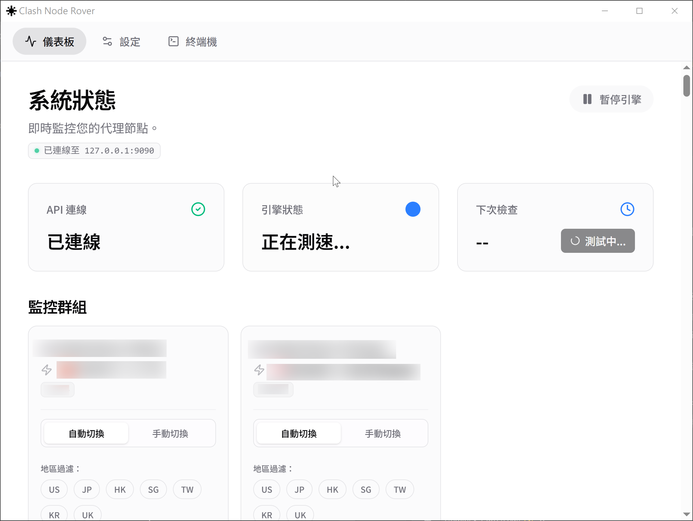

[English](README_en.md) | [繁體中文](README.md) | [简体中文](README_zh-CN.md)

# Clash Node Rover

<p align="center">
  
</p>

**Clash Node Rover** 是一个基于 Rust 与 Tauri 构建的高性能后台引擎与图形化管理工具，专门用来监控并自动将您的 Clash / Clash Meta 代理切换到当下最快、最稳定的节点。

---

## ✨ 核心亮点

- 🚀 **智能动态测速引擎**：在后台使用极低的资源持续并发测试您的代理节点。采用加权平均与抖动 (Jitter) 计算出综合分数，一旦发现显著优于当前的节点，即会自动无缝切换。
- 📊 **历史效能追踪与图表**：告别单一时间点的测速！独家提供高达 7 天的历史连线延迟图表，节点在不同时段稳不稳定一目了然。
- 🛡️ **本地网络防护机制 (Local Network Check)**：在执行任何测速与切换前，引擎会自动检测本地网络（透过 DNS 探测），避免因本地断网而误判所有优质节点失效。
- 🌐 **HTTP 深度连网验证**：支持在切换前透过指定的 HTTP Proxy 进行真实网页访问测试，确保节点不仅“Ping 得通”，而且“能顺畅连网”。
- 🎨 **现代化多语系界面**：使用 React + TailwindCSS 打造精美的玻璃拟物化 (Glassmorphism) UI，支持繁体中文、简体中文与英文。

---

## 📥 安装与使用

### 1. 下载安装
请前往 [Releases](../../releases) 页面下载最新版本的 `.exe` 或 `.msi` 安装包进行安装。

### 2. 初始设定 (Setup Wizard)
1. **连接 API**：启动后，软件将引导您连接至 Clash API (通常为 `http://127.0.0.1:9090`)，如果您有设定 Secret 请一并输入。
2. **选择群组**：勾选您希望 Rover 监控并自动切换的**代理群组 (Selectors)**。
3. **完成**：开始享受全自动的网络优化体验！

---

## ⚙️ 高级核心机制说明

### 切换容忍度 (Switch Tolerance)
为了避免频繁切换节点导致网络连线中断（例如看视频或游戏时的卡顿），Rover 引入了容忍度机制。当新节点的综合分数并没有超过“当前节点分数 + 容忍度”时，系统将维持现有节点。

### 退避算法 (Backoff Rounds)
对于连续测速超时 (Timeout) 或真实连网测试失败的节点，系统会根据您设定的次数，将该节点标记为“退避状态”。处于退避状态的节点在接下来的几个测速轮次中将被直接跳过，大幅节省系统发送无效请求的负担。

---

## 🛠️ 开发与自行编译

本项目使用 `Tauri v2`、`Rust` 与 `React` 进行开发。如果您希望自行编译或贡献代码：

```bash
# 1. 安装前端依赖
npm install

# 2. 启动开发者模式
npm run dev

# 3. 编译正式发行版 (Windows 下将产生 .exe 与 .msi)
npm run tauri build
```

## 📄 授权条款
MIT License
